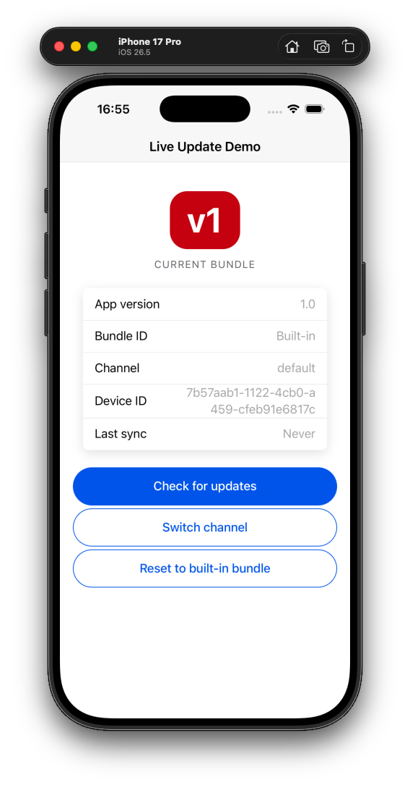

# Capacitor Live Update Demo

[](https://github.com/capawesome-team/capacitor-live-update-demo/actions/workflows/live-update.yml)
[](https://github.com/capawesome-team/capacitor-live-update-demo/actions/workflows/native-build.yml)

⚡️ A simple Capacitor app that demonstrates the [Capacitor Live Update plugin](https://capawesome.io/plugins/live-update/).

It ships with a **pre-configured Capawesome Cloud app**, so live updates work out of the box — no account or setup required. Just install the app and try it.

<p align="center">
  
</p>

## Features

- 📦 **Over-the-air updates** — ship new web bundles without an app store release.
- 🏷️ **Visible version badge** — a large `v1` / `v2` badge makes each update obvious on screen.
- 🔀 **Channel switching** — move the device between live update channels at runtime.
- ↩️ **Automatic rollback** — a faulty bundle is reverted to the last working one.
- 🍎 **Swift Package Manager** — iOS dependencies without CocoaPods.

## Tech Stack

- [Capacitor](https://capacitorjs.com/) — Android + iOS
- [Ionic Core](https://ionicframework.com/docs/components) (web components, loaded from CDN) — UI, no frontend framework
- [Vite](https://vitejs.dev/) — web build
- [Swift Package Manager](https://www.swift.org/documentation/package-manager/) — native iOS dependencies (no CocoaPods)

## Getting Started

### Prerequisites

- [Node.js](https://nodejs.org)
- Android: [Android Studio](https://developer.android.com/studio)
- iOS: [Xcode](https://apps.apple.com/app/xcode/id497799835) (dependencies are managed with Swift Package Manager — no CocoaPods needed)

### Installation

```bash
git clone https://github.com/capawesome-team/capacitor-live-update-demo.git
cd capacitor-live-update-demo
npm install
npm run build
```

### Running

```bash
# Android
npx cap run android

# iOS
npx cap run ios

# Web (development only)
npm start
```

The app is already wired to a live Capawesome Cloud app, so it receives updates automatically — no extra configuration needed.

## Usage

The screen shows a large **bundle badge** (`v1`) and a status card with the current bundle ID, channel, device ID, and last sync time. When a newer bundle is published to the cloud, the app detects it on resume and offers to reload — and the badge changes to reflect the new bundle.

You don't need to publish anything to see this work. Every push to `main` automatically publishes a fresh bundle (see [Continuous Integration](#continuous-integration)), so there is normally an update waiting for you out of the box — just run the app and try it:

1. Run the app on a device or simulator — the badge shows `v1`.
2. Send the app to the background, then reopen it. It detects the update and asks to reload.
3. Accept — the badge now shows `v2`. 🎉

Use **Switch channel** to move the device between channels, and **Reset to built-in bundle** to roll back to the bundle that shipped inside the app.

> [!NOTE]
> Live update bundles expire after a while, so an unused one may eventually disappear. If the app reports that you're already on the latest version and no update shows up, just [open an issue](https://github.com/capawesome-team/capacitor-live-update-demo/issues) and we'll publish a fresh bundle for you.

## Configuration

The app uses a pre-configured demo cloud app out of the box. To publish your own bundles instead:

1. Create an app in the [Capawesome Cloud Console](https://cloud.capawesome.io/).
2. Sign in to the CLI: `npx @capawesome/cli login`.
3. Replace the `LiveUpdate.appId` in [`capacitor.config.json`](capacitor.config.json) with your app ID.

## Continuous Integration

Two GitHub Actions workflows are included:

- [`live-update.yml`](.github/workflows/live-update.yml) — bumps the badge to `v2`, builds the web assets, and uploads the bundle to Capawesome Cloud with the [Capawesome CLI](https://capawesome.io/docs/cloud/cli/):
  ```bash
  npx @capawesome/cli apps:liveupdates:upload --app-id <APP_ID> --path dist --channel default --yes
  ```
  Runs on every push to `main` (ignoring Markdown-only changes) and on manual dispatch. Requires the `CAPAWESOME_CLOUD_TOKEN` secret.

- [`native-build.yml`](.github/workflows/native-build.yml) — builds native Android and iOS apps in the cloud via [Capawesome Cloud Native Builds](https://capawesome.io/docs/cloud/native-builds/), which also verifies the SPM setup compiles. Requires the `CAPAWESOME_CLOUD_TOKEN` and `CAPAWESOME_CLOUD_APP_ID` secrets.

## Learn More

- **`LiveUpdate.ready()`** — call once on startup so a faulty bundle can be rolled back automatically if you never reach it.
- **`sync()` / `reload()` / `reset()`** — check for a new bundle, apply it, or roll back to the built-in one.
- **Channels** — route bundles to different audiences (e.g. `default`, `beta`). This demo uses the `default` channel.

See the [plugin documentation](https://capawesome.io/plugins/live-update/) for the full API.

## License

Released under the [MIT License](LICENSE).
